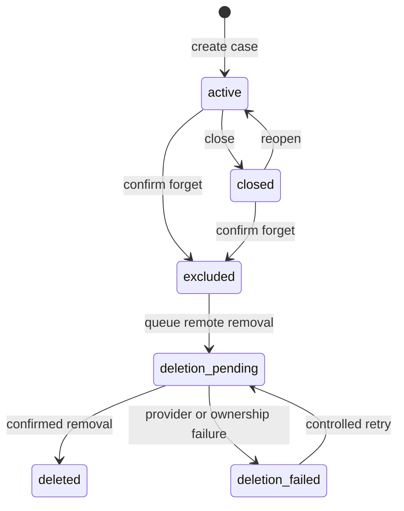

# Web workspace and conversations

## Interaction model

The user selects **Continue with Google**, signs in, and accepts the processing notice. The home screen lists their opportunities. **Add opportunity** creates a record; each record opens a chat, current-details panel, and source timeline. The account-wide **My memory** screen shows private general-memory items and their origins.

The app receives text the user supplies. Sign-in does not import their Gmail messages or establish that an opportunity is legitimate. Pasted names, emails, and original timestamps remain unverified unless the evidence supports a narrower statement. See the [account flow](12-account-and-opportunity-flow.md).

Each analysis visibly identifies its opportunity. Escape rendered text, keep suspect URLs inert, and use source drawers for long excerpts. Persisted messages reappear after refresh; progress and saving status are distinct from completed analysis.

## Screens and actions

| Screen | What the user sees | Main actions |
|---|---|---|
| Sign-in | Product purpose and Google sign-in | Continue with Google |
| Opportunities | Owned opportunity cards, last update, open checks | Add opportunity · Open |
| Opportunity chat | User contributions and sourced second opinions | Add update · Ask a question |
| Details | Role, claimed company, terms, unresolved changes | View source · Correct detail |
| Timeline | Dated contributions, corrections, reported checks | Earlier · View source |
| My memory | Private preferences and open-check references | Confirm preference · Correct · Forget |
| Settings | Profile, processing notice, session and deletion controls | Sign out · Forget account |

Within an opportunity, provide **Add verification**, **Close**, **Reopen**, and **Forget opportunity** actions. Closing preserves history; forgetting initiates the exclusion/removal flow below. Select an opportunity before accepting its chat input. Do not silently merge opportunities or use a global mutable active-case variable for multiple browser tabs.

## First use

**Welcome:** “SecondLook helps you compare a new job or collaboration message with what you were told earlier. Create an opportunity, add the details you have, and keep the next updates together.”

**Processing notice:** “Information you choose to analyze is processed by SecondLook, DeepSeek, Jev, and the managed Walrus Memory service. Saved content is encrypted on Walrus, but these services can process the text. SecondLook operates the memory account. You can inspect or correct saved information and request its removal. Please remove passwords, OTPs, private keys, and identity documents before sending.”

**Buttons:** `Continue` · `Privacy`

Store consent version and acceptance time separately from Google sign-in. A refusal causes no model or MemWal content call. Do not silently apply materially expanded data sharing under an old consent version.

## Scenario A: a condition changes

The following is a synthetic demonstration using fictional terms.

**Day 1 — user pastes into the opportunity chat:** “The contract pays $1,500 monthly. Applicants pay no fees.”

**Assistant:**

> Case: Frontend contractor offer
>
> The message offers $1,500 monthly and says applicants pay no fees. [S1]
>
> I can’t confirm who sent it from this message alone. Before sharing sensitive information, confirm the role through a company contact you find independently.
>
> Saved for later comparison.

“Saved” appears only after the memory write finishes. While it is pending, use “Saving this message…” and show the storage status separately from the analysis.

**Day 3 — user adds an update to the same opportunity:** “Send a refundable $60 onboarding deposit today to secure the role.”

**Assistant:**

> The new payment request changes the earlier condition.
>
> Earlier: “Applicants pay no fees.” [S1]
> Now: “Send a refundable $60 onboarding deposit…” [S2]
>
> Calling it refundable does not explain that change. I’d pause payment and confirm the request through a company contact you find independently.
>
> Still unresolved: who authorized the deposit?

**Buttons:** `View sources` · `Add verification` · `Correct this`

Source buttons open stored excerpts inside the authenticated opportunity workspace. A citation identifies evidence inside this opportunity, not a public trust badge. The details panel updates alongside the answer; My memory separately shows eligible general-memory updates.

## Scenario B: the explanation changes the assessment

**User:** “I checked through the contact listed on the company's careers site. They said the new onboarding vendor is authorized.”

**Assistant:** “I’ll record that you report confirming the vendor through the careers-site contact. Which domain did they confirm?”

The bot saves the user's reported method and result. It does not upgrade the domain to “verified by SecondLook.” If the user supplies enough detail, the domain discrepancy can be marked **addressed by reported verification**, while other outstanding issues stay open.

Later answers mention that result: “You reported confirming this vendor through the careers-site contact. I have no new conflicting information about the vendor in this case.” They do not imply the entire offer is safe.

## Scenario C: a correction

**User:** “You read that wrong. They said the company pays the equipment deposit, not me.”

**Assistant:** “I previously extracted ‘applicant pays equipment deposit’ from S3. Your correction is ‘company pays equipment deposit.’ Save that correction?”

After confirmation, append a correction event. Retain the original excerpt, mark the old interpretation superseded, and regenerate the assessment. If the text is unambiguous, the new interpretation can cite it. If the source cannot establish the correction, attribute the replacement to the user's correction.

Never edit the historical source text to make it agree with the correction.

## Scenario D: insufficient or ambiguous evidence

**User:** “They changed it again.”

**Assistant:** “What changed—the amount, contact, deadline, or onboarding link? Send the new wording so I can compare it with this case.”

Do not fill in a change from the user's emotional tone. If “they” could refer to two contacts, ask which contact. If a quoted passage has no date, record its receipt time and leave its original date unknown.

## Case lifecycle

Closing preserves memory and allows reopening. Forgetting immediately removes the case from responses and schedules removal of copies under our control. Remote deletion can remain pending or fail; that status must stay visible. “Deleted” means confirmed removal through the supported storage flow plus application cleanup, not a promise to erase recipient screenshots, provider logs, or copies retained in the original messaging service.

## Failure messages

| Failure | User-facing response |
|---|---|
| MemWal write still pending | “I have the message, but saving is still in progress. I’ll update the status when it completes.” |
| Recall unavailable | “I can’t retrieve the earlier evidence right now. I can comment on this message alone, but I can’t reliably compare it with your history.” |
| Some recalled blobs failed | “Some earlier evidence is unavailable. This comparison may be incomplete.” |
| Jev unavailable | “The structured comparison is unavailable. Here are the relevant messages; I haven’t classified the change.” |
| DeepSeek extraction failed validation | “I couldn’t reliably read that passage. Please send a shorter excerpt or clarify the condition you want checked.” |
| Unsupported image/file/voice | “This version checks text. Please paste the relevant wording.” |
| Wrong case selected | “Choose which case this update belongs to before I save it.” |
| Deletion pending | “I’ve stopped using this case. Storage removal is pending; you can check its status here.” |

A delayed response remains attached to its opportunity, even if the user opened another opportunity or browser tab. Incomplete analysis never becomes a reassuring success state.
