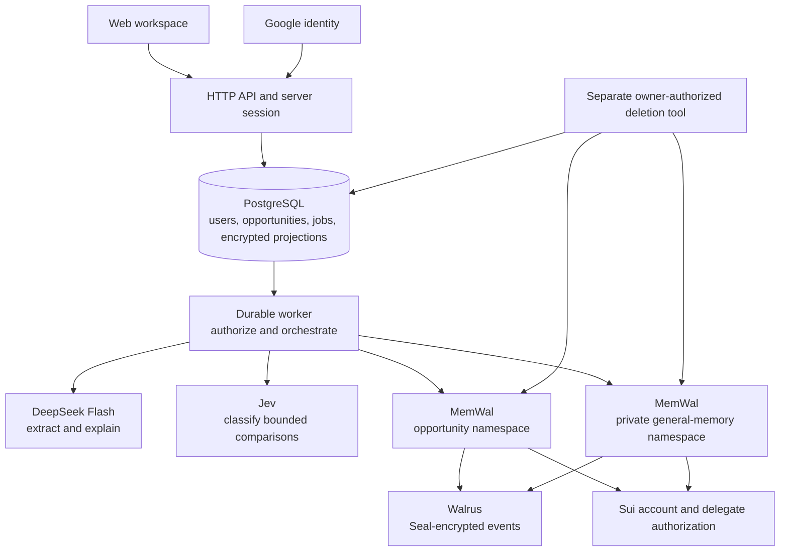

# Architecture

## System shape

The primary product is a web workspace with Google sign-in. Use a TypeScript application with a web frontend, HTTP API, and durable worker. PostgreSQL stores identities, sessions, queues, opportunity projections, and general-memory dependency metadata. MemWal archives content-bearing events and supplies semantic recall. The first release does not require Telegram.



The frontend has no provider credentials. Models receive selected evidence, not database connections, authentication authority, or tools that can contact recruiters. The application owns identity, permissions, state changes, and final grounding policy.

## Responsibilities

| Component | Owns | Boundary |
|---|---|---|
| Auth adapter | Google identity validation and local sessions | Profile data does not confer opportunity trust or Gmail access |
| Web/API layer | Opportunity selection, forms/chat, consent, status | Never trusts a client-supplied user ID |
| Application service | Authorization, idempotent commands, quotas | Model output cannot directly mutate rows |
| Extractor | Candidate claims with exact source passages | No identity certification or direct memory writes |
| Evidence selector | Active opportunity projection and scoped recall | General memory is a separately labeled context source |
| Jev adapter | Typed comparison and candidate categorization | No fraud probability or authority over permissions |
| Assessment policy | Source checks, uncertainty, allowed response | Missing evidence does not imply reassurance |
| Opportunity projector | Current details backed by confirmed event history | New claims cannot silently erase conflicting earlier terms |
| General-memory projector | Eligible, sourced account-wide items | Maintains dependency invalidation and per-user revision |
| MemWal adapter | Archive submission, polling, recall | Cannot call an accepted write saved |
| Deletion tool | Exact owner-authorized blob removal | No account-wide deletion for a single opportunity request |

## Normal update sequence

```mermaid
sequenceDiagram
    participant U as Browser
    participant A as Authenticated API
    participant P as PostgreSQL
    participant W as Worker
    participant D as DeepSeek
    participant M as MemWal
    participant J as Jev
    U->>A: POST opportunity message + CSRF + idempotency key
    A->>P: authorize, freeze intake, enqueue atomically
    A-->>U: 202 with job and opportunity IDs
    W->>P: lease job and check exclusions
    W->>D: extract candidate claims from untrusted text
    D-->>W: JSON with exact quotes
    W->>W: validate and freeze event
    W->>P: save write intent and stable idempotency key
    W->>M: submit to exact opportunity namespace
    M-->>W: accepted provider job ID
    W->>P: save provider job ID
    W->>M: resumable status polling
    M-->>W: done and blob ID
    W->>P: confirm archive and project opportunity details
    W->>M: recall earlier opportunity sources and eligible general context
    M-->>W: separate scoped result sets
    W->>P: reconcile current corrections and dependency states
    W->>J: compare bounded sourced claims
    J-->>W: typed results
    W->>D: explain validated comparison as JSON
    D-->>W: proposed assessment
    W->>W: check citations and permitted conclusions
    W->>P: persist assessment and queue eligible memory promotion
    U->>A: poll authorized job/conversation state
    A-->>U: saved opportunity, answer, general-memory status
    W->>M: archive accepted general-memory revision
    M-->>W: accepted job; poll until done
    W->>P: activate revision if dependencies still current
```

A suggested user preference needs confirmation before promotion. An open-check reference can be added automatically with its originating opportunity. Do not wait indefinitely for that second write before showing a completed opportunity assessment: display its separate pending status.

## Identity and authorization

Google sign-in establishes a local user; an opaque server-side session authenticates subsequent requests. See [integrations](06-integrations.md#google-sign-in). Every route queries resources by authenticated user plus opportunity ID. Session cookies are Secure, HttpOnly, and appropriately SameSite; protect state-changing requests against CSRF and validate allowed origins. Never place provider secrets in browser bundles or local storage.

The browser supplies no MemWal namespace. The server derives exact opportunity/general namespaces after authorization. Existing contract `tenant_id` maps to local user UUID; `case_id` maps to opportunity UUID. Account profile fields stay out of LLM prompts unless specifically necessary.

## Database and memory responsibilities

PostgreSQL holds an encrypted current-details column per opportunity, source projections, identity/session state, jobs, exclusions, and general-memory dependency edges. Every content-bearing projection references a confirmed MemWal archive event. Temporary intake is distinct from confirmed memory.

MemWal is the persistent event archive and semantic retrieval layer. Exact source views and correction overlays use the encrypted database projection; approximate recall cannot establish completeness. The MVP requires both systems. The SDK does not guarantee complete database-free restoration, and the owner read API returns metadata rather than a full plaintext export. Keep backups and exercise recovery. [MemWal read API](https://docs.wal.app/walrus-memory/api/memory-read-api), [SDK reference](https://docs.wal.app/walrus-memory/sdk/api-reference)

General memory consists of addressable items with sources and revisions, not one endlessly overwritten summary. A user view may summarize those items, but that summary is disposable and cannot become independent evidence.

## Ordering and recovery

Serialize operations per opportunity with sequence numbers and leases/fencing tokens. Serialize general-memory projection per user or use compare-and-swap revisions. Do not hold database transactions across provider calls. Recheck source dependencies and exclusions before activating a general-memory revision.

Use unique constraints for `(user_id, idempotency_key)`, logical event IDs, archive write keys, and assessment identities. A retry with the same key but different payload returns a conflict. A lost HTTP response resumes the existing operation. A lease expiry permits recovery, not a second logical write.

| Interruption | Recovery |
|---|---|
| Intake transaction fails | Return retryable error; do not report acceptance |
| Acceptance response is lost | Same user/key returns the existing job |
| MemWal accepts but response is lost | Retry frozen bytes with the saved write key |
| Worker stops while polling | Resume original provider job |
| Remote write completes before DB confirmation | Reconcile status and project once |
| General-memory promotion fails | Opportunity remains saved; general-memory status stays pending/failed |
| Source corrected during promotion | Invalidate candidate; rebuild from current dependencies |
| Two tabs update different opportunities | Keep request opportunity IDs explicit; serialize account-memory revisions |
| Forget occurs during processing | Immediately exclude, suppress output, reconcile late writes for deletion |
| Browser disconnects or refreshes | Read persisted job/messages after reauthentication; do not rerun the action |

## Proposed implementation layout

```text
web/                         # sign-in, opportunity list, chat/details, My memory
src/entrypoints/http.ts       # authenticated API, frontend serving, health
src/entrypoints/worker.ts     # durable workflow and retention jobs
src/auth/                    # Google adapter, sessions, CSRF
src/application/             # use cases, policy, memory promotion
src/domain/                  # opportunity, claim, correction, memory dependency
src/providers/               # DeepSeek, Jev, MemWal
src/persistence/             # SQL repositories, encryption, queue, leases
src/prompts/                 # versioned extraction and explanation
src/observability/           # redacted metrics and logs
migrations/
scripts/                     # smoke checks and restricted owner deletion
tests/
```

These are proposed paths, not an implemented application. Telegram can be added later as an explicitly linked channel using these same services; it is not the current account identity or primary interface.
