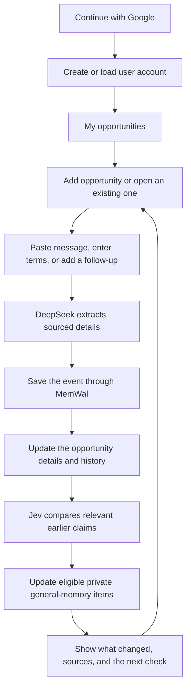

# Account, opportunity, and general-memory flow

This is the current product direction, revised from the original Telegram-first proposal in response to the founder's clarification. The first release is a web app with Google sign-in, a database record per opportunity, and a private general memory per user. Shared memory across users is not assumed or authorized.

## The experience



The diagram shows the user-facing cycle; the detailed execution sequence is in [architecture](03-architecture.md). General-memory writes are separately tracked, so a slow general-memory update does not hide a successfully saved opportunity update.

After sign-in, the home screen shows opportunity cards with a label, last update, open checks, and a continuation button. Inside an opportunity, the user sees a chat, a current-details panel, and a timeline. A separate **My memory** view explains what the assistant remembers across opportunities and why.

## Account information

Use Google authentication to create a local user UUID. Link the account using the validated Google subject identifier, not email as the primary key. Store only useful profile fields such as name, email, and optional avatar; they are not opportunity evidence. Use Google's supported identity flow and validate identity on the server. [Google OpenID Connect](https://developers.google.com/identity/openid-connect/openid-connect)

Request basic sign-in scopes only. No Gmail mailbox scope is required for this product flow. Users supply opportunity information themselves; future inbox import needs a separate authorization and ingestion design. [Google OAuth scopes](https://developers.google.com/identity/protocols/oauth2/scopes)

## One user, many opportunity records

Do not put all opportunities into one column on `users`. Give each opportunity its own row linked to the user:

```text
users
  id
  google_issuer + google_sub (unique identity)
  encrypted profile {name, email, optional avatar}

opportunities
  id
  user_id -> users.id
  details_ciphertext -> encrypted structured opportunity details
  details_revision
  status
  last_activity_at

opportunity_events
  opportunity_id + user_id
  immutable source, extracted claims, corrections, and archive references

general_memory_items
  user_id
  encrypted statement
  kind + revision + status
  source references and MemWal archive reference

general_memory_dependencies
  memory_item_id -> originating opportunity/event/claim
```

`opportunity_events` is the conceptual history; the implementation table is `memory_events`. Existing v1 JSON contracts use `case_id` to mean the opportunity's UUID and `tenant_id` to mean the user's UUID. Keep this mapping explicit until a versioned schema migration; do not create a second unrelated case identity.

## The opportunity details column

The logical column contains structured JSON, encrypted before storage as `details_ciphertext`. This preserves the earlier specification's content encryption rather than adding a plaintext copy. If a future implementation chooses plaintext `jsonb`, revise the privacy/storage design explicitly.

Illustrative decrypted shape:

```json
{
  "label": "Frontend contract",
  "company_claimed": "Northstar Example",
  "role": "Frontend developer",
  "compensation": { "amount": 1500, "currency": "USD", "period": "month" },
  "applicant_fee": {
    "state": "conflicting_claims",
    "earlier": "No applicant fees",
    "latest_request": "Refundable onboarding deposit"
  },
  "open_checks": ["Confirm who authorized the deposit"],
  "source_event_ids": ["event-1", "event-2"]
}
```

This is a display illustration, not a schema-valid event fixture. Unknown fields stay null/unknown. The details are a projection of confirmed sourced events, not a replacement for history. A conflicting claim remains visible instead of silently overwriting the earlier term. Each displayed field or change can open its source.

## The two memory scopes

| Scope | What belongs here | Example |
|---|---|---|
| Opportunity memory | Claims, terms, messages, corrections, and checks about this specific opportunity | “This offer originally said no applicant fees.” |
| Private general memory | User-declared preferences and attributed references useful across the user's opportunities | “You prefer remote contracts”; “A fee check remains open in opportunity A.” |

Opportunity state is automatically updated after validated event persistence. General-memory promotion follows deterministic eligibility rules, with Jev providing a proposed category rather than final authority:

- Explicit user preferences can be proposed for confirmation before becoming account-wide defaults.
- Open-check references can appear in the user's overall activity view with their originating opportunity clearly labeled.
- Repeated patterns can be phrased as observations about the user's saved records, with citations and a count of distinct opportunities. They cannot become assertions about a company's legitimacy.
- Raw contact details, private messages, and inferred personality traits are not automatically copied into broad memory.
- A claim in opportunity A never becomes evidence about opportunity B merely because names or domains resemble each other. Any cross-opportunity comparison must be relevant, labeled, and sourced.

For the first implementation, support only confirmed preferences and open-check references. Pattern learning is deferred until there is enough real evidence to evaluate it. This keeps the general-memory behavior specific and reviewable.

## Update algorithm

1. Authenticate the local session and authorize the selected opportunity.
2. Accept text with an idempotency key; persist encrypted intake and enqueue processing.
3. Extract claims with DeepSeek, validate quotations, freeze the event, and save it through MemWal.
4. When persistence reaches `done`, update the opportunity projection and append the timeline entry atomically.
5. Retrieve relevant prior sources; Jev classifies supported differences, and DeepSeek explains the validated result.
6. Create an account-memory candidate only if it meets the allowed promotion rules. User preferences await confirmation; an open-check pointer retains its originating opportunity.
7. Serialize accepted promotions per user, archive the versioned general-memory event in a separate user namespace, and activate the new projection only after confirmation.
8. Show separate states: opportunity saved, comparison available, and general memory updated/pending. One failed write must not be represented as three successes.

Use exact namespaces such as `sl1_<user-hmac>_<opportunity-uuid>` and `sl1_<user-hmac>_general`. Namespace names are routing labels; authorization remains server enforced.

## Corrections, forgetting, and concurrency

Every derived item retains source dependencies. A correction or forget request immediately makes affected general-memory items ineligible for retrieval, even if an asynchronous re-computation/removal job is still pending. Rebuild or remove those items; do not leave an account summary containing information the user just removed from an opportunity.

A preference explicitly confirmed in **My memory** is an independent user statement and has its own source. An opportunity deletion does not silently delete that independently confirmed statement; the UI explains that it can be removed from My memory. A preference that exists only as an inference from the deleted opportunity has no such exception and is removed.

Two opportunity updates may complete concurrently. Their general-memory updates use a per-user lease or compare-and-swap revision so one does not overwrite the other. Record both `source_revision` and `memory_revision`; discard a late job if its dependencies changed. Before delivery or retrieval, check the user exclusion state as well as each dependency's state.

Forgetting the entire account excludes every opportunity and general-memory item, revokes sessions, and queues removal of all associated blobs and application copies. Do not require signing in again to continue an already accepted deletion job.

## What makes this product specific

Google sign-in and a database are infrastructure. The product's distinctive behavior is the visible progression: **what you were told → what changed → what remains unresolved → what the assistant now remembers**. The user can trace and correct that progression. The broader memory helps the next interaction without confusing one opportunity's facts with another's.
